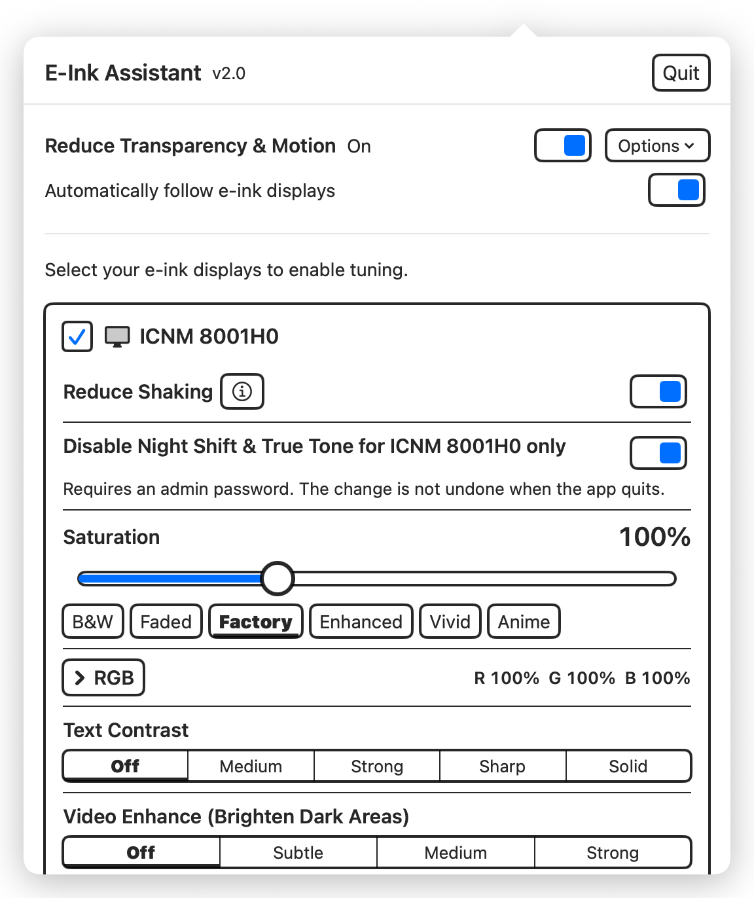
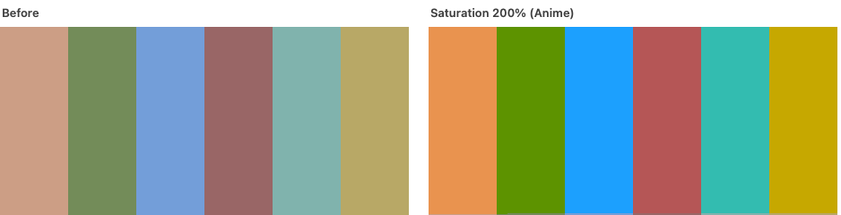
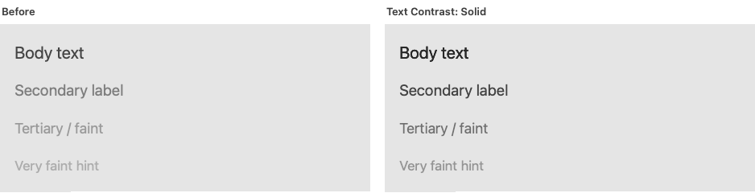
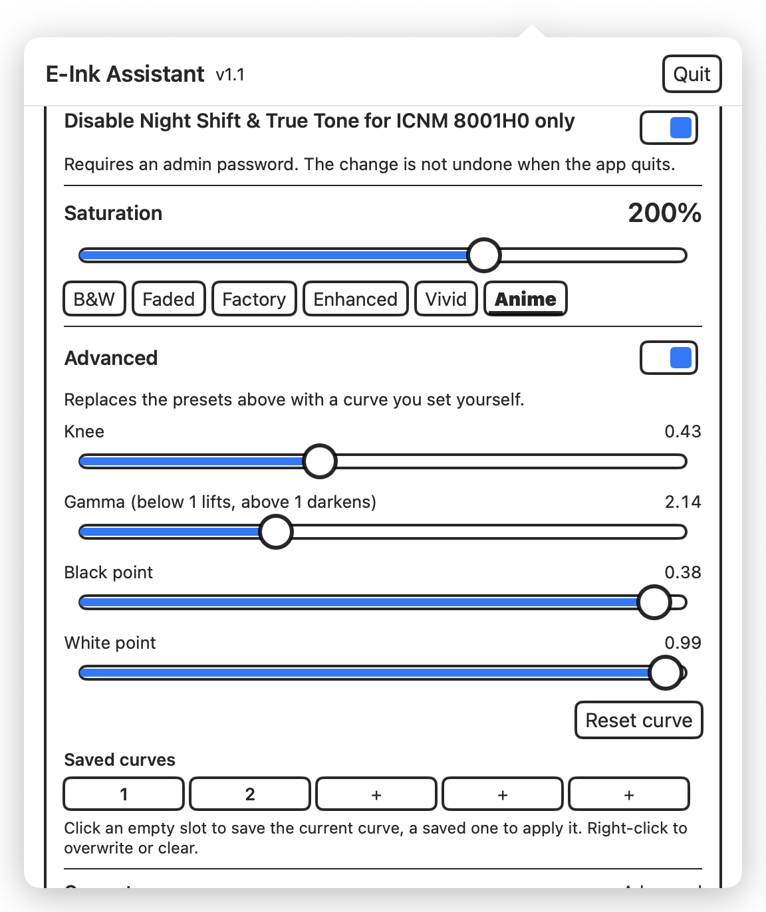
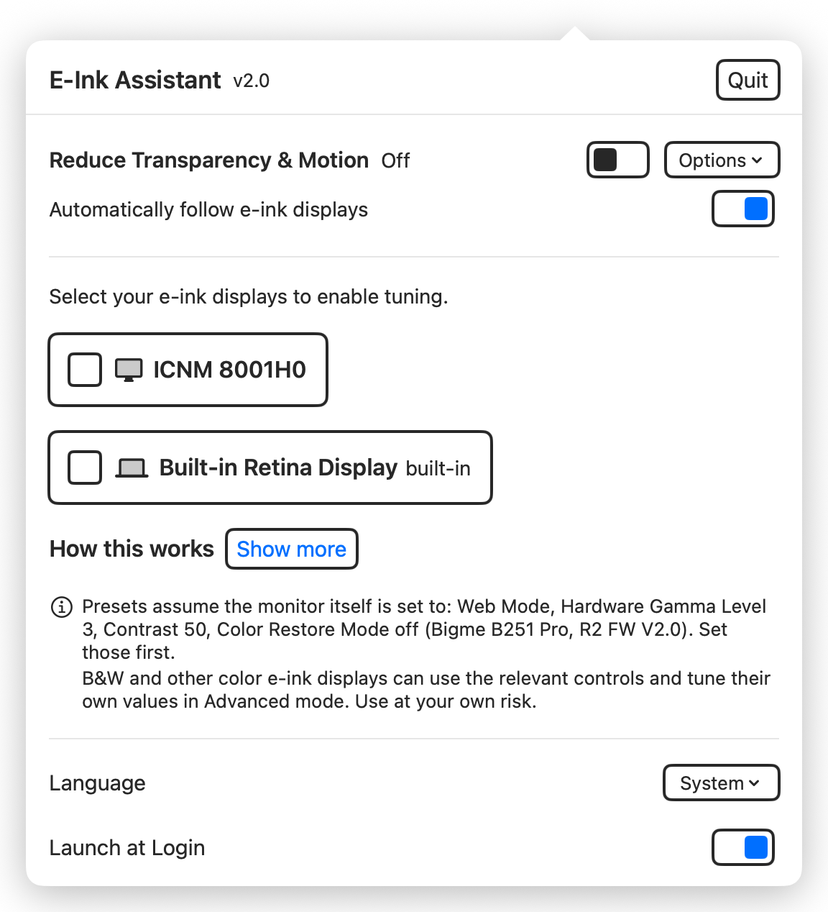

# E-Ink Assistant

<p align="center">
  <b>English</b> &nbsp;·&nbsp; <a href="README.zh-Hans.md">简体中文介绍</a>
</p>

**Make a colour e-ink monitor look right on macOS.**

Colour e-ink panels are washed out, low contrast, and shimmer under macOS's
dithering. This is a small menu bar app that fixes all three, per display, so
your laptop screen is left alone.

No permissions. No background service beyond the app itself. MIT licensed.

<p align="center">
  
</p>

---

## What it does

### Reduce Shaking

macOS dithers display output to smooth gradients. An LCD refreshes the pattern
away; e-ink holds every pixel, so it becomes a constant shimmer. Turning it off
makes the picture sit still.

On by default when you mark a display as e-ink, because it is usually the first
thing people notice.

### Disable Night Shift & True Tone

Both shift colour and tone, fighting the adjustments below. macOS withholds them
from displays it treats as televisions, so this marks the chosen display as one.

**This display only** — other screens keep Night Shift and True Tone. Needs an
administrator password and a **restart**, and is the one setting not undone when
you quit. Existing overrides, including custom scaled resolutions, are kept.

### Saturation

A colour e-ink panel puts a colour filter over a monochrome screen, which costs
most of the gamut. Boosting saturation compensates.



Presets **Factory / Enhanced / Vivid / Anime**, or a slider from 60% to 300%.

### Text Contrast

Darkens text so it separates from the page on a panel with very little contrast
to spend. Faint and secondary text gains the most: at the strongest level its
contrast roughly triples.



Four levels: **Medium, Strong, Sharp, Solid**. Solid also crushes antialiased
edges to solid black, which looks crisper but harder-edged.

### Video Enhance (Brighten Dark Areas)

Brightens only the darkest tones and leaves mid-tones and highlights exactly as
they were, so shadow detail that e-ink normally crushes into mush becomes
visible again.


Three levels: **Subtle, Medium, Strong**.

It cannot tell dark video from dark text, so it lightens text too. **Use it for
video and photos, and turn it off for reading.** The app says so whenever a
level is active, and it and Text Contrast are mutually exclusive.

### Advanced

Full control of the curve (knee, gamma, black point, white point) with a live
plot and five saveable, renameable slots.

<p align="center">
  
</p>

> The comparison images are generated from the app's real transforms and
> rendered on an LCD. The text and video images additionally simulate a
> low-contrast e-ink panel, since that is the situation those adjustments
> address; the saturation image shows the transform directly. What you actually
> see depends on your panel.

---

## Install

Requires **macOS 14 or later** on **Apple Silicon**.

```
git clone https://github.com/kiteretsu903/eink-assistant.git
cd eink-assistant
./build.sh
open "E-Ink Assistant.app"
```

Or download the app from [Releases](../../releases).

### First launch: getting past Gatekeeper

The app is **ad-hoc signed, not notarized**, so macOS refuses to open a
downloaded copy the first time.

On **macOS 15 and later, right-click → Open no longer works.** Do this instead:

1. Try to open the app once, and dismiss the warning.
2. Open **System Settings → Privacy & Security**.
3. Scroll down to a line saying the app was blocked, with an **Open Anyway**
   button.
4. Click it and confirm.

If that button does not appear, clear the quarantine flag directly:

```
xattr -dr com.apple.quarantine "/path/to/E-Ink Assistant.app"
```

Building from source avoids this entirely: locally built apps are never
quarantined.

---

## Using it

<p align="center">
  
</p>

1. Open the app from the menu bar.
2. Tick your e-ink display. Controls appear only for ticked displays.
3. Reduce Shaking comes on automatically. Adjust saturation to taste.
4. Turn on Text Contrast for reading, or Video Enhance for video. Not both.

**Everything is restored when you quit** and re-applied when you launch, so the
app has to be running for its settings to apply. Turn on **Launch at Login** to
have that happen automatically.

---

## Scope

**Set the monitor up first, then use the app.** The presets assume the display's
own hardware settings are already in place. On a **Bigme B251 Pro** (R2 FW V2.0)
that means **Web Mode, Hardware Gamma Level 3, Contrast 50, Color Restore Mode
off**, set in the monitor's own menu. Every value here was tuned by eye against
that combination, so a different hardware setup wants different numbers.

**Other colour e-ink monitors should benefit too.** Nothing in the mechanism is
panel-specific, and **Advanced mode exposes the whole curve**, so another panel
can be dialled in directly rather than being stuck with these presets. You are
tuning it yourself at that point, so use at your own risk.

Reduce Shaking is Apple Silicon only, and hides itself where unsupported.

---

## More

- [CHANGELOG.md](CHANGELOG.md): what changed in each version
- [TECHNICAL.md](TECHNICAL.md): how it works, what was measured, and what does
  *not* work on modern macOS
- [mac-saturation](https://github.com/kiteretsu903/mac-saturation): the
  investigation behind the colour mechanism, plus a CLI for exporting profiles

## License and credits

MIT, see [LICENSE](LICENSE).

**Reduce Shaking is based on [Stillcolor](https://github.com/aiaf/Stillcolor) by
Abdullah Arif** (MIT). Stillcolor worked out that display dithering can be
disabled through the `enableDither` I/O Registry property, which is the whole
basis of that feature here. This project reimplements the idea narrowed to a
single display; the credit for finding it belongs to Stillcolor. Thank you.

Full notices in [THIRD-PARTY-NOTICES.md](THIRD-PARTY-NOTICES.md).
