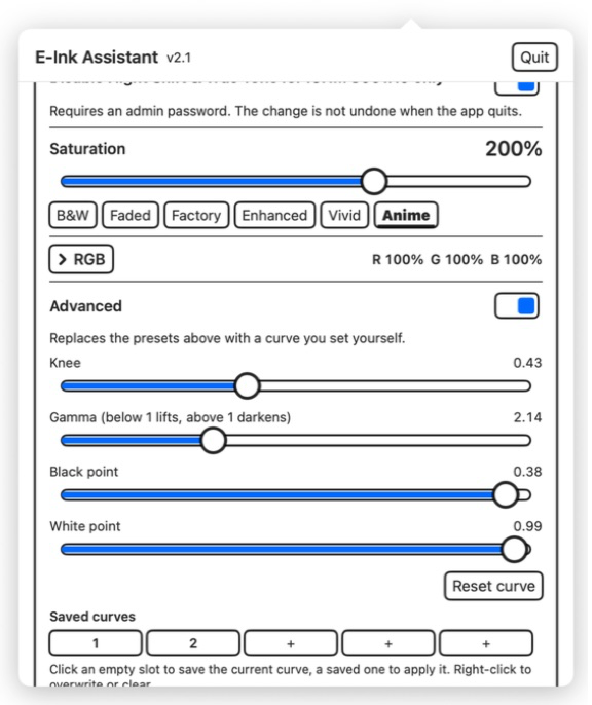

# E-Ink Assistant

<p align="center">
  <b>English</b> &nbsp;·&nbsp;
  <a href="docs/i18n/README.zh-Hans.md">简体中文</a> &nbsp;·&nbsp;
  <a href="docs/i18n/README.zh-Hant.md">繁體中文</a> &nbsp;·&nbsp;
  <a href="docs/i18n/README.ja.md">日本語</a>
</p>

<p align="center">
  
</p>

**Tune black-and-white and color e-ink displays for macOS.**

> **Windows port:** this repository also contains a Qt 5.15/C++ Windows port
> with Windows 7-compatible core features plus one runtime-selected color
> package: MHC2 saturation on Windows 10 builds 19041–19045 and ACM on
> Windows 11 24H2 or above.
> See [WINDOWS.md](WINDOWS.md) for compatibility, building, and testing.
> Maintainers and coding agents should also read the authoritative
> [Windows engineering reference](WINDOWS-TECHNICAL.md).

[Visit the product website](https://kiteretsu903.github.io/eink-assistant/)

Both B&W and color e-ink share the problems of slow refresh, limited contrast,
crushed shadow detail, and visible macOS dithering. E-Ink Assistant is a small
menu bar app that addresses those problems per display, leaving your laptop
screen alone. Color panels additionally get saturation and direct RGB controls.

No permissions for the core display controls. No background service beyond the
app itself. MIT licensed.

## Latest release

**v2.5 — September 2, 2026**

- Added dismissible hardware-setup guidance above the controls, including a
  Bigme B251 Pro example.
- Reworked the welcome panel into three concise, icon-led setup points.
- Built-in displays now appear after external displays in the selection list.

[Download the latest release](../../releases/latest) · [Read the full changelog](CHANGELOG.md)

<p align="center">
  
</p>

## Key features

- **For B&W and color e-ink:** reduce dithering shimmer, deepen text, recover
  dark detail in video and photos, and reduce system transparency and motion.
- **For color e-ink:** compensate for a narrow color gamut with saturation,
  then correct color casts with direct Red, Green, and Blue controls.
- **Reading and media modes:** Text Contrast and Video Enhance are separate,
  mutually exclusive tools for opposite jobs.
- **Per-display control:** tune only marked e-ink panels; other displays remain
  untouched.
- **Safe lifecycle:** display adjustments restore on quit and reapply on launch.
  The optional accessibility helper turns off when the app exits.
- **Advanced tuning:** edit the complete tone curve and save five named presets.

### What color e-ink displays benefit from

- Everything listed for B&W e-ink below.
- **Saturation compensation** to strengthen a narrow color gamut, with six
  presets and a 0%–300% slider.
- **Direct RGB correction** from 0%–200% per channel to remove red, green, or
  blue color casts. RGB values are saved separately for each display.
- **Per-display Night Shift and True Tone control** so macOS color-temperature
  processing does not fight deliberate color tuning.

### What B&W e-ink displays benefit from

- **Reduce Shaking** to stop visible macOS dithering shimmer on supported
  displays.
- **Text Contrast** to make faint and secondary text darker and easier to read.
- **Video Enhance** to recover shadow detail in videos and photos.
- **Reduce Transparency & Motion** to simplify system visuals and avoid
  slow-refresh animation.
- **Advanced tone-curve tuning** for the panel's specific contrast response.
- **Optional Night Shift and True Tone control** when macOS tone shifting
  visibly affects grayscale output.

---

## Feature details

### Reduce Shaking — B&W and color

macOS dithers display output to smooth gradients. An LCD refreshes the pattern
away; e-ink holds every pixel, so the pattern can become a constant shimmer.
Disabling it makes the picture sit still. This turns on automatically when you
mark a supported display as e-ink.

### Text Contrast — B&W and color

Darkens text so it separates from the page on a low-contrast panel. Faint and
secondary text gains the most: at the strongest level its signal contrast is
roughly quadrupled.


Four levels: **Medium, Strong, Sharp, Solid**. Medium now equals the former
Strong setting; each level after it is more aggressive. Solid heavily crushes
the black point for maximum separation, which looks crisper but loses more gray
detail and soft edges.

### Video Enhance — B&W and color

Brightens only the darkest tones while leaving mid-tones and highlights alone,
so shadow detail that e-ink normally crushes becomes visible again.


Three levels: **Subtle, Medium, Strong**. It cannot distinguish dark imagery
from dark text, so it lightens text too. **Use it for video and photos, and turn
it off for reading.** Video Enhance and Text Contrast are mutually exclusive.

### Saturation — color e-ink

Color e-ink places a color filter over a monochrome panel, which costs much of
the gamut. Saturation compensation restores stronger color signals. B&W panels
can simply leave this at 100%.


Presets **B&W / Faded / Factory / Enhanced / Vivid / Anime**, or a slider from
0% to 300%.

### RGB — color e-ink

Adjust **Red, Green, and Blue directly from 0% to 200%** to correct a panel's
color cast. The controls are collapsed by default; select **RGB** to reveal the
three sliders. The compact row always shows the current values. Each display
keeps its own RGB values. **Reset RGB** returns all three channels to the
neutral 100% setting.

RGB and Saturation share one per-display color profile, so they work together
without interfering with Text Contrast or Video Enhance.

### Disable Night Shift & True Tone — primarily color e-ink

Both features shift color and tone, which can fight deliberate display tuning.
E-Ink Assistant can mark only the selected display as a television so macOS
withholds them from that panel. This may also help a B&W panel affected by tone
shifting.

Other screens keep Night Shift and True Tone. This requires an administrator
password and **disconnecting and reconnecting that display**, and is the one setting not undone on quit. Existing
overrides, including custom scaled resolutions, are preserved.

### Reduce Transparency & Motion — B&W and color

These system accessibility settings improve legibility and avoid animation that
slow-refresh panels cannot display well. A one-time, user-confirmed Shortcuts
helper gives the app a safe On/Off control and optional connection automation.

### Advanced — B&W and color

Full control of knee, gamma, black point, and white point, with a live plot and
five saveable, renameable slots.

<p align="center">
  
</p>

> The comparison images are illustrative feature previews. Actual results depend
> on the panel and source material.

---

## Install

Requires **macOS 14 or later** on **Apple Silicon**.

```
git clone https://github.com/kiteretsu903/eink-assistant.git
cd eink-assistant
./build.sh
open "E-Ink Assistant.app"
```

Recommended: download the `.dmg` from [Releases](../../releases), open it, and
drag **E-Ink Assistant** onto the **Applications** folder shown in the installer.

### First launch: getting past Gatekeeper

The app is **ad-hoc signed, not notarized**, so macOS refuses to open a
downloaded copy the first time. On **macOS 15 and later, right-click → Open no
longer works.**

1. Try to open the app once, then dismiss the warning.
2. Open **System Settings → Privacy & Security**.
3. Find the message that the app was blocked and click **Open Anyway**.
4. Confirm.

After dragging the app to **Applications**, if the button still does not appear,
clear the quarantine flag directly:

```
xattr -dr com.apple.quarantine "/Applications/E-Ink Assistant.app"
```

Building from source avoids quarantine entirely.

---

## Using it

<p align="center">
  
</p>

1. Open the app from the menu bar.
2. Mark each B&W or color e-ink display you want to tune.
3. Reduce Shaking comes on automatically where supported.
4. On color e-ink, adjust Saturation and RGB. On B&W, leave them at 100%.
5. Choose Text Contrast for reading or Video Enhance for media—not both.

The system-wide **Reduce Transparency & Motion** row has a one-time **Install &
Enable** setup. Confirm **Add Shortcut** in Apple's Shortcuts app. The bundled
helper accepts Text only, recognizes exact `on` and `off` commands, ignores
everything else, and ends with `Nothing` so it produces no output. It is not
exposed in Share Sheet, Spotlight, Quick Actions, or the lock-screen interface.
It can run in the background while the Mac is locked so automatic display
following and quit cleanup remain reliable. The app does not list or inspect
your other shortcuts.

Automatic mode turns both settings on when a marked e-ink display connects and
off only after the last marked e-ink display disconnects. Quitting the app also
turns them off.

**Display adjustments restore when you quit** and reapply when you launch. Turn
on **Launch at Login** for automatic startup.

---

## Display scope and presets

The core tools—Reduce Shaking, Text Contrast, Video Enhance, accessibility
controls, and Advanced curves—can benefit **both B&W and color e-ink**.
Saturation and RGB correction are specifically for color panels.

Set the monitor hardware first. The bundled presets were tuned by eye on a
**Bigme B251 Pro** (R2 FW V2.0) using **Web Mode, Hardware Gamma Level 3,
Contrast 50, Color Restore Mode off**. A B&W panel or another color model will
need its own values; Advanced mode exposes the complete curve for that purpose.
Use custom tuning at your own risk.

Reduce Shaking is Apple Silicon only and hides itself where unsupported.

---

## More

- [CHANGELOG.md](CHANGELOG.md): what changed in each version
- [TECHNICAL.md](TECHNICAL.md): implementation, measurements, and approaches
  that do *not* work on modern macOS
- [mac-saturation](https://github.com/kiteretsu903/mac-saturation): the color
  mechanism investigation and a profile-export CLI

## License and credits

MIT, see [LICENSE](LICENSE).

**Reduce Shaking is based on [Stillcolor](https://github.com/aiaf/Stillcolor) by
Abdullah Arif** (MIT). Stillcolor discovered that display dithering can be
disabled through the `enableDither` I/O Registry property. This project
reimplements that idea per display; credit for the discovery belongs to
Stillcolor. Thank you.

Full notices in [THIRD-PARTY-NOTICES.md](THIRD-PARTY-NOTICES.md).
