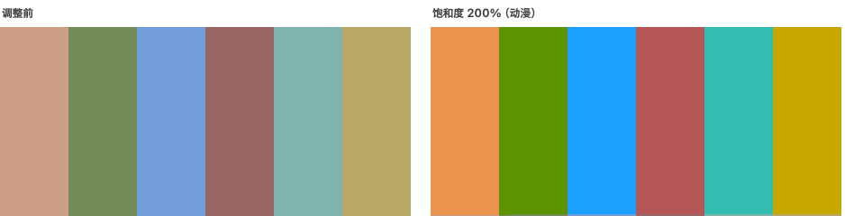

# 墨水屏助手

<p align="center">
  <a href="README.md">English</a> &nbsp;·&nbsp; <b>简体中文介绍</b>
</p>

**让彩色墨水屏显示器在 macOS 上正常显示。**

彩色墨水屏发灰、对比度低，还会因为 macOS 的抖动处理而不停闪烁。这是一个小巧的菜单栏应用，
逐显示器解决这三个问题，你的笔记本内屏不受影响。

无需任何权限。除应用本身外没有后台服务。MIT 开源协议。

<p align="center">
  
</p>

---

## 功能

### 减少抖动

macOS 会用抖动（dithering）让渐变更平滑。LCD 会在刷新中把这种图案抹掉，而墨水屏会保持每一个
像素，于是它就变成了持续的闪烁。关掉之后画面就稳定下来了。

勾选显示器为墨水屏时会自动开启，因为这通常是最先被注意到的问题。

### 关闭 Night Shift 与原彩显示

这两项都会改变颜色和色调，与下面的各项调整互相干扰。macOS 不会对被识别为电视的显示器应用它们，
因此这里把选中的显示器标记为电视。

**只对这一台生效**，其他屏幕仍保留 Night Shift 与原彩显示。需要管理员密码，**重启后**才生效，
也是唯一不会在退出时还原的设置。原有的覆盖设置（例如自定义缩放分辨率）会保留。

### 饱和度

彩色墨水屏是在黑白屏上加了一层彩色滤光片，因此损失了大部分色域。提高饱和度可以补偿这一点。



预设 **黑白 / 淡彩 / 原厂 / 增强 / 艳丽 / 动漫**，也可以用滑块在 0%–300% 之间调节。

### 文字对比度

加深文字，让它在对比度本就很有限的屏幕上和背景区分开。浅色和次要文字受益最大：在最强档位下，
它们的对比度大约提升到三倍。


四个档位：**中等、强、锐利、实边**。实边还会把抗锯齿边缘压成纯黑，更清晰，但边缘会显得偏硬。

### 视频暗部增强

只提亮最暗的部分，中间调和高光完全不变，让墨水屏通常会糊成一团的暗部细节重新可见。


三个档位：**轻微、中等、强**。

它无法区分暗部画面和深色文字，所以文字也会一起变浅。**建议看视频和照片时开启，阅读时关闭。**
应用在档位开启时会给出提示，并且它与文字对比度互斥。

### 高级

直接控制曲线（拐点、伽马、黑点、白点），带实时曲线图，以及五个可保存、可重命名的槽位。

<p align="center">
  
</p>

> 上面的对比图是用应用真实的算法生成的模拟效果，在 LCD 上渲染。文字对比度和视频暗部增强两张图
> 额外模拟了低对比度墨水屏的显示效果，因为这两项调整正是要解决那种情况；饱和度那张则是直接
> 展示算法本身。实际观感取决于你的屏幕。

---

## 安装

需要 **macOS 14 或更高版本**，**Apple Silicon**。

```
git clone https://github.com/kiteretsu903/eink-assistant.git
cd eink-assistant
./build.sh
open "E-Ink Assistant.app"
```

也可以从 [Releases](../../releases) 下载。

### 首次启动：通过 Gatekeeper

本应用是**自签名（ad-hoc），未经过 Apple 公证**，所以 macOS 第一次会拒绝打开下载来的版本。

**在 macOS 15 及以上版本，右键“打开”已经不再有效。** 请按以下步骤操作：

1. 先尝试打开一次应用，关掉弹出的警告。
2. 打开**系统设置 → 隐私与安全性**。
3. 向下滚动，会看到一行提示该应用已被阻止，旁边有**仍要打开**按钮。
4. 点击并确认。

如果没有出现该按钮，可以直接清除隔离标记：

```
xattr -dr com.apple.quarantine "/path/to/E-Ink Assistant.app"
```

自行从源码编译则完全不会遇到这个问题：本地编译的应用不会被加上隔离标记。

---

## 使用

<p align="center">
  
</p>

1. 从菜单栏打开应用。
2. 勾选你的墨水屏显示器。只有勾选后才会出现各项控制。
3. 减少抖动会自动开启。然后按需要调整饱和度。
4. 阅读时开启文字对比度，看视频时开启视频暗部增强，两者不要同时开。

**退出应用时所有设置都会还原**，启动时再重新应用，因此应用需要保持运行。希望自动生效的话，
请打开**登录时启动**。

---

## 适用范围

**先设置好显示器，再使用本应用。** 预设的前提是显示器自身的硬件设置已经调好。在
**Bigme B251 Pro**（固件版本 R2 FW V2.0）上是指:在显示器自带菜单里设为**网页模式、
硬件伽马“等级3”、对比度 50、色彩还原模式关闭**。所有数值都是对着这一组配置用眼睛调出来的，
换一组硬件设置就需要另一套数值。

**其他彩色墨水屏显示器同样可能受益。** 原理本身并不局限于某一块屏幕，而且**高级模式可以直接
调整整条曲线**，因此别的屏幕可以自行调到合适的效果，不必迁就这里的预设。那种情况下等于你自己
在调，请自行斟酌使用，风险自负。

减少抖动仅支持 Apple Silicon，在不支持的硬件上会自动隐藏。

---

## 更多

- [CHANGELOG.md](CHANGELOG.md)：各版本更新内容
- [TECHNICAL.md](TECHNICAL.md)：实现原理、实测数据，以及在新版 macOS 上**行不通**的做法（英文）
- [mac-saturation](https://github.com/kiteretsu903/mac-saturation)：颜色部分的完整调查过程，
  以及一个导出配置文件的命令行工具（英文）

## 许可与致谢

MIT，见 [LICENSE](LICENSE)。

**减少抖动基于 [Stillcolor](https://github.com/aiaf/Stillcolor)（作者 Abdullah Arif，MIT
协议）。** Stillcolor 发现了可以通过 `enableDither` 这个 I/O Registry 属性关闭显示器抖动，
这正是本功能的全部基础。本项目在此基础上重新实现，并把作用范围从全部显示器收窄到单个显示器；
发现这个方法的功劳属于 Stillcolor。感谢。

完整声明见 [THIRD-PARTY-NOTICES.md](THIRD-PARTY-NOTICES.md)。
