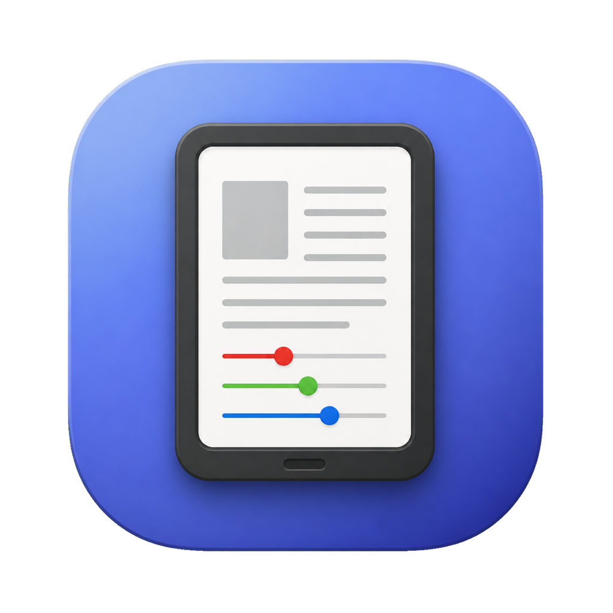
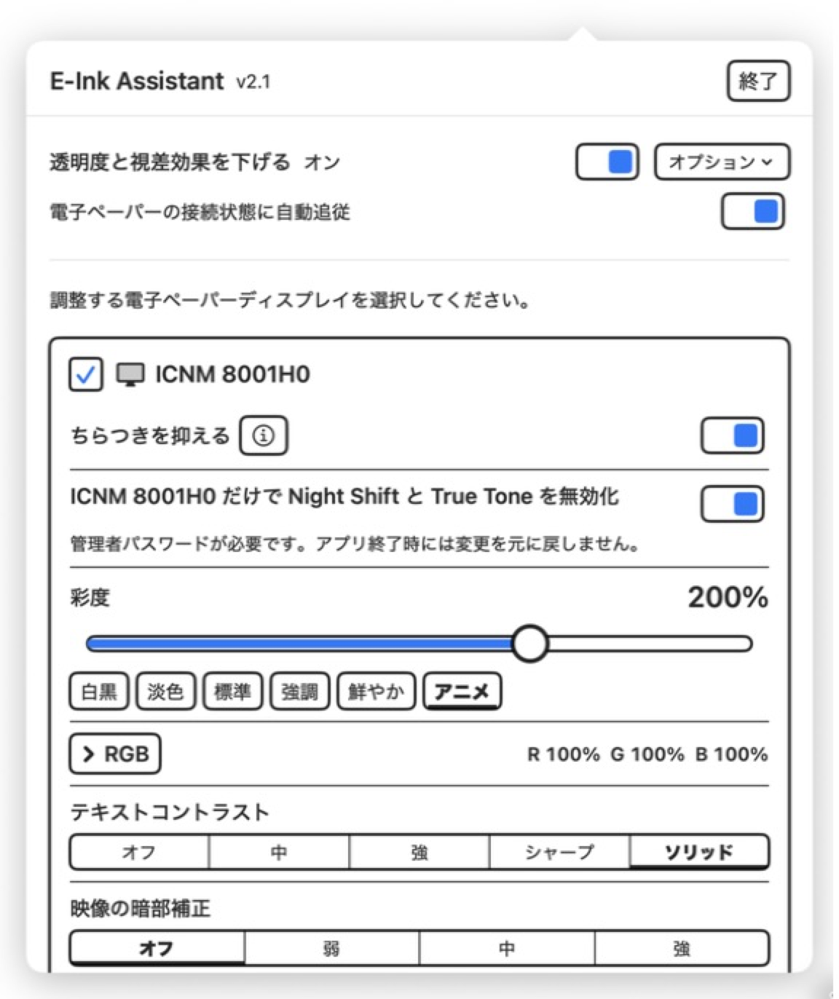
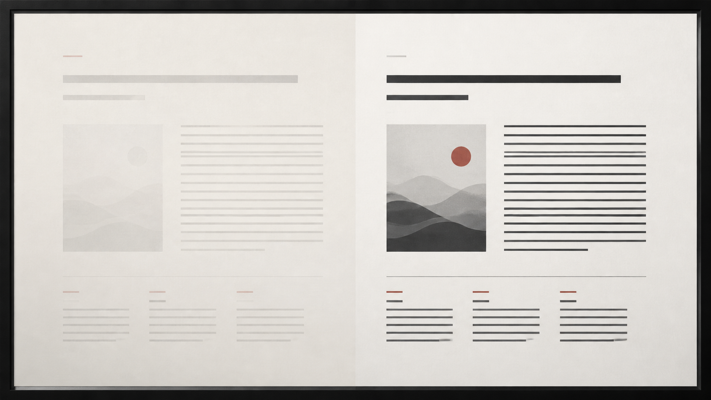
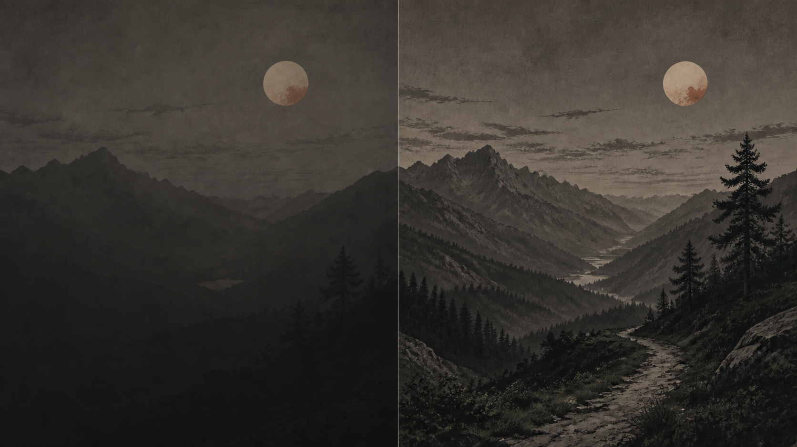
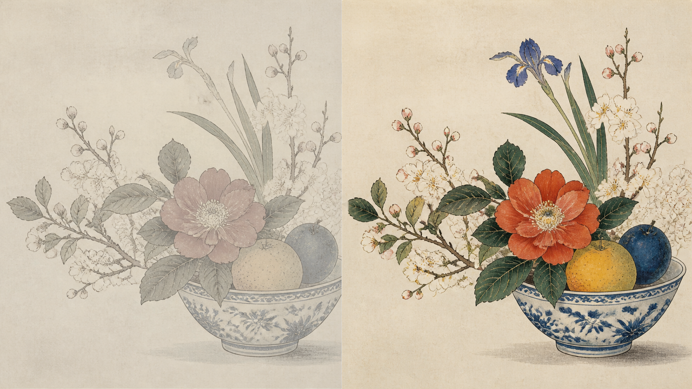
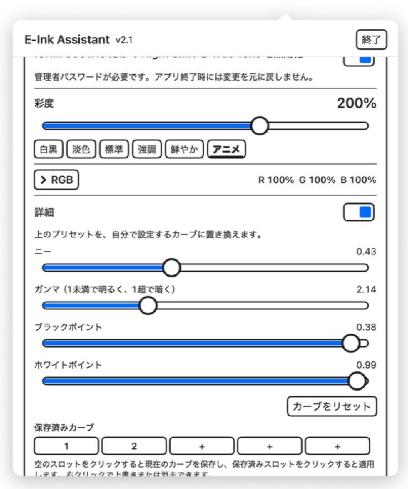
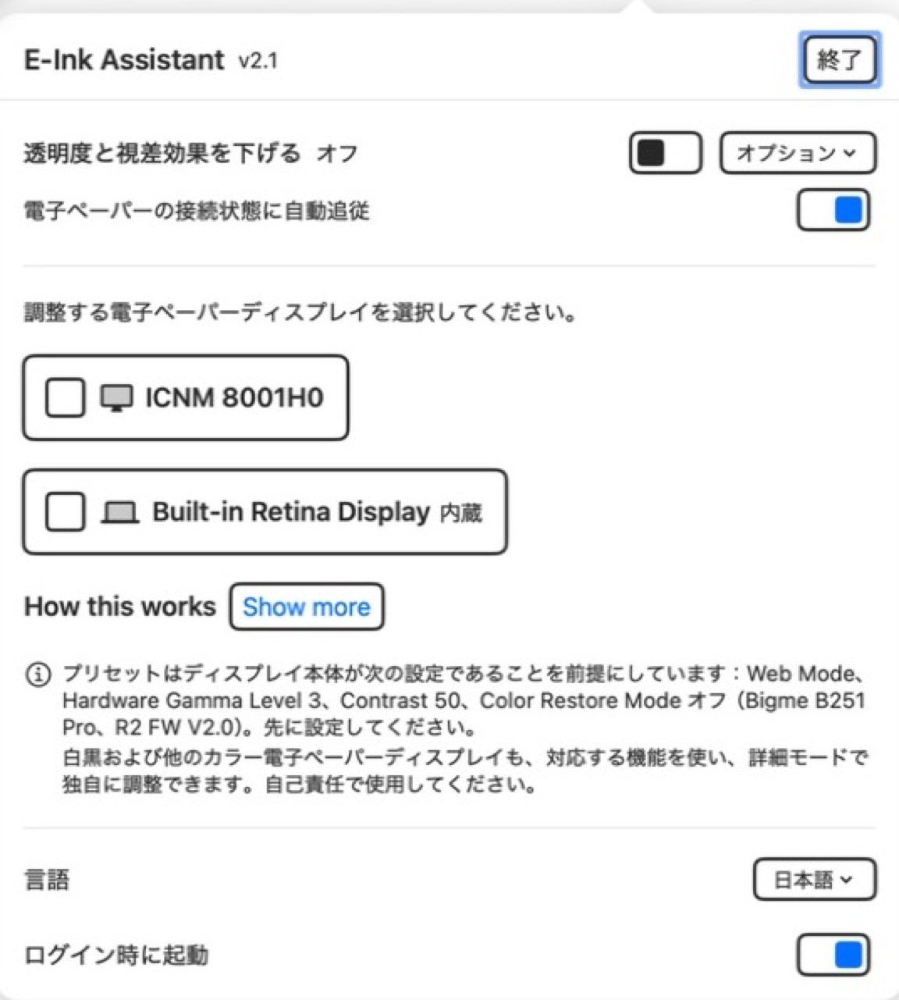

# E-Ink Assistant

<p align="center">
  <a href="../../README.md">English</a> &nbsp;·&nbsp;
  <a href="README.zh-Hans.md">简体中文</a> &nbsp;·&nbsp;
  <a href="README.zh-Hant.md">繁體中文</a> &nbsp;·&nbsp;
  <b>日本語</b>
</p>

<p align="center">
  
</p>

**macOSで白黒・カラー電子ペーパーディスプレイを調整します。**

白黒とカラーの電子ペーパーには、更新が遅い、コントラストが限られる、暗部がつぶれる、macOSの
ディザリングが見えるという共通の課題があります。E-Ink Assistantは、MacBookの内蔵画面に
影響を与えず、指定したディスプレイだけを調整する小さなメニューバーアプリです。カラーパネルでは
彩度とRGBを直接調整できます。

MITライセンスです。

## 最新バージョン

**v2.5 — 2026年9月2日**

- コントロール上部に、Bigme B251 Pro の例を含む閉じられる本体設定ガイドを追加しました。
- ようこそパネルを、簡潔な3つのアイコン付き設定ポイントに変更しました。
- ディスプレイ選択では外付けディスプレイを先に、内蔵ディスプレイを最後に表示します。

[最新バージョンをダウンロード](https://github.com/kiteretsu903/eink-assistant/releases/latest) · [変更履歴をすべて読む](../../CHANGELOG.md)

<p align="center">
  
</p>

## 主な機能

- **白黒・カラー共通**：ディザリングのちらつきを抑え、文字を濃くし、動画や写真の暗部を復元し、
  システムの透明度と動きを減らします。
- **カラー電子ペーパー向け**：彩度で狭い色域を補正し、赤・緑・青を直接調整して色かぶりを補正します。
- **読書とメディアを分離**：テキストコントラストと映像の暗部補正は目的が逆のため、同時には使いません。
- **ディスプレイごとの制御**：登録した電子ペーパーパネルだけを調整し、他の画面には影響しません。
- **安全な復元**：終了時に表示調整を元へ戻し、起動時に再適用します。補助機能も終了時にオフになります。
- **詳細調整**：トーンカーブ全体を編集し、名前を付けた5個のプリセットを保存できます。

### カラー電子ペーパーで得られる効果

- 下記の白黒電子ペーパー向け機能をすべて利用できます。
- **彩度補正**：狭い色域を強調します。6種類のプリセットと0%〜300%のスライダーを備えています。
- **RGBの直接補正**：各チャンネルを0%〜200%で調整し、赤・緑・青の色かぶりを補正します。
  RGB値はディスプレイごとに保存されます。
- **ディスプレイ別のNight Shift・True Tone制御**：macOSの色温度処理が意図した色調整と
  競合するのを防ぎます。

### 白黒電子ペーパーで得られる効果

- **ちらつきを抑える**：対応ディスプレイで目立つmacOSのディザリングのちらつきを止めます。
- **テキストコントラスト**：薄い文字や補助的な文字を濃くし、読みやすくします。
- **映像の暗部補正**：動画や写真の暗部ディテールを復元します。
- **透明度を下げる・視差効果を減らす**：システム表示を簡素化し、更新の遅い画面で見づらくなるアニメーションを減らします。
- **詳細なトーンカーブ調整**：パネル固有のコントラスト特性に合わせて調整できます。
- **Night Shift・True Toneの任意制御**：macOSの色調変化がグレースケール出力へ明らかに
  影響する場合に利用できます。

---

## 機能の詳細

### ちらつきを抑える — 白黒・カラー

macOSは階調を滑らかにするため表示出力をディザリングします。LCDでは更新によって模様が消えますが、
電子ペーパーは各ピクセルを保持するため、模様が常時ちらついて見えることがあります。無効にすると
画面が静止します。対応ディスプレイを電子ペーパーとして登録すると自動でオンになります。

### テキストコントラスト — 白黒・カラー

文字を濃くし、低コントラストのパネルでも背景から判別しやすくします。薄い文字や補助的な文字ほど
効果が大きく、最強設定では信号上のコントラストがおよそ4倍になります。



**中、強、シャープ、ソリッド**の4段階です。「中」は以前の「強」と同じで、以降は段階ごに
さらに強くなります。ソリッドは黒点を大幅につぶすため、くっきりしますが階調が減り、字形も硬く見えます。

### 映像の暗部補正 — 白黒・カラー

中間調とハイライトを変えず、最も暗い階調だけを明るくします。電子ペーパーでつぶれやすい動画や
写真の暗部を見えるようにします。



**弱、中、強**の3段階です。暗い映像と濃い文字を区別できないため、文字も薄くなります。
**動画や写真ではオン、読書ではオフ**にしてください。テキストコントラストとは同時に使えません。

### 彩度 — カラー電子ペーパー

カラー電子ペーパーは白黒パネルにカラーフィルターを重ねるため、色域の多くを失います。彩度補正で
より強いカラー信号を送れます。白黒パネルでは100%のままで構いません。



**白黒 / 淡色 / 標準 / 強調 / 鮮やか / アニメ**のプリセット、または0%〜300%のスライダーを使えます。

### RGB — カラー電子ペーパー

**赤・緑・青を0%〜200%の範囲で直接調整**して、パネルの色かぶりを補正します。RGB値は
ディスプレイごとに保存されます。コントロールは初期状態で折りたたまれており、**RGB**を選ぶと
3本のスライダーが表示されます。折りたたんだ状態でも現在値を確認できます。**RGBをリセット**すると
3チャンネルすべてが中立の100%に戻ります。

RGBと彩度は1つのディスプレイ別カラープロファイルに統合されるため、同時に使用でき、テキスト
コントラストや映像の暗部補正には干渉しません。

### Night ShiftとTrue Toneを無効化 — 主にカラー電子ペーパー

どちらも色と階調を変えるため、意図した表示調整と競合する場合があります。選択したディスプレイだけを
テレビとして登録し、macOSがそのパネルへ両機能を適用しないようにできます。システムの色調変化の
影響を受ける白黒パネルにも役立つ場合があります。

他の画面ではNight ShiftとTrue Toneが維持されます。管理者パスワードと**そのディスプレイの再接続**が必要で、
終了時に元へ戻らない唯一の設定です。カスタム拡大解像度など既存の上書き設定は保持されます。

### 透明度を下げる・視差効果を減らす — 白黒・カラー

システムのアクセシビリティ設定で読みやすさを改善し、更新の遅いパネルが苦手なアニメーションを
減らします。ユーザーが一度確認する補助ショートカットにより、安全なオン／オフ操作と接続連動が使えます。

### 詳細モード — 白黒・カラー

ニー、ガンマ、ブラックポイント、ホワイトポイントを直接操作できます。ライブグラフと、保存・改名
できる5つのスロットがあります。

<p align="center">
  
</p>

> 比較画像はアプリの実際の変換を使い、LCD上でレンダリングしています。文字と映像の例では低コントラスト
> 電子ペーパーもシミュレートし、彩度の例はカラー変換を直接示します。実際の結果はパネルに依存します。

---

## インストール

**macOS 14以降**と**Apple Silicon**が必要です。

```
git clone https://github.com/kiteretsu903/eink-assistant.git
cd eink-assistant
./build.sh
open "E-Ink Assistant.app"
```

推奨方法は、[Releases](https://github.com/kiteretsu903/eink-assistant/releases)から`.dmg`をダウンロードして開き、
**E-Ink Assistant**をインストーラー内の**Applications**フォルダへドラッグすることです。

### 初回起動：Gatekeeperを通過する

アプリは**ad-hoc署名で、Appleの公証を受けていません**。そのため、ダウンロード版は初回に
macOSから拒否されます。**macOS 15以降では、右クリック →「開く」は機能しません。**

1. 一度アプリを開こうとして、警告を閉じます。
2. **システム設定 → プライバシーとセキュリティ**を開きます。
3. アプリがブロックされたという表示を探し、**このまま開く**をクリックします。
4. 確認します。

アプリを**Applications**フォルダへドラッグした後もボタンが表示されない場合は、隔離属性を直接削除できます。

```
xattr -dr com.apple.quarantine "/Applications/E-Ink Assistant.app"
```

ソースからビルドした場合、隔離属性は付きません。

---

## 使い方

<p align="center">
  
</p>

1. メニューバーからアプリを開きます。
2. 調整する白黒またはカラー電子ペーパーディスプレイを登録します。
3. 対応ディスプレイでは、ちらつき低減が自動でオンになります。
4. カラー電子ペーパーでは彩度とRGBを調整し、白黒ではすべて100%のままにします。
5. 読書にはテキストコントラスト、メディアには映像の暗部補正を選びます。両方は使いません。

システム全体の**透明度を下げる・視差効果を減らす**機能には、初回だけ**インストールしてオン**の設定が必要です。
Appleの「ショートカット」で**ショートカットを追加**を確認してください。付属の補助ショートカットは
テキストだけを受け取り、完全一致する`on`と`off`だけを認識し、それ以外を無視します。最後を
`Nothing`で終えるため出力はありません。共有シート、Spotlight、クイックアクション、ロック画面の
インターフェイスには表示されません。ディスプレイへの自動追従と終了時のクリーンアップを確実にするため、
Macがロック中でもアプリからバックグラウンドで実行できます。アプリが他のショートカットを一覧表示または
確認することもありません。

自動モードでは、登録した電子ペーパーが接続されると2つの設定をオンにし、最後の1台が切断された後だけ
オフにします。アプリ終了時にも両方をオフにします。

**表示調整は終了時に元へ戻り**、起動時に再適用されます。自動起動には**ログイン時に起動**をオンにします。

---

## 対応範囲とプリセット

ちらつき低減、テキストコントラスト、映像の暗部補正、アクセシビリティ設定、詳細カーブは、
**白黒とカラーの両方の電子ペーパー**に役立ちます。彩度補正とRGB補正はカラーパネル専用です。

先にディスプレイ本体を設定してください。内蔵プリセットは **Bigme B251 Pro**（R2 FW V2.0）を
**Web Mode、Hardware Gamma Level 3、Contrast 50、Color Restore Mode オフ**にして目視調整した
ものです。白黒パネルや別のカラー機種には独自の値が必要です。詳細モードでカーブ全体を調整できます。
実際の表示を確認しながら、パネルに合う値へ調整してください。

ちらつき低減はApple Siliconのみ対応し、非対応環境では自動的に非表示になります。

---

## その他

- [CHANGELOG.md](../../CHANGELOG.md)：バージョンごとの変更内容（英語）
- [TECHNICAL.md](../../TECHNICAL.md)：実装、測定値、現行macOSで**機能しない**方法（英語）
- [mac-saturation](https://github.com/kiteretsu903/mac-saturation)：カラー機構の調査とプロファイル書き出しCLI（英語）

## ライセンスとクレジット

MITです。[LICENSE](../../LICENSE)を参照してください。

**ちらつき低減はAbdullah Arifによる
[Stillcolor](https://github.com/aiaf/Stillcolor)（MIT）を基にしています。** Stillcolorは
`enableDither` I/O Registryプロパティでディスプレイのディザリングを無効化できることを発見しました。
本プロジェクトはそのアイデアをディスプレイ単位で再実装しています。発見の功績はStillcolorにあります。
ありがとうございます。

完全な表記は[THIRD-PARTY-NOTICES.md](../../THIRD-PARTY-NOTICES.md)にあります。
