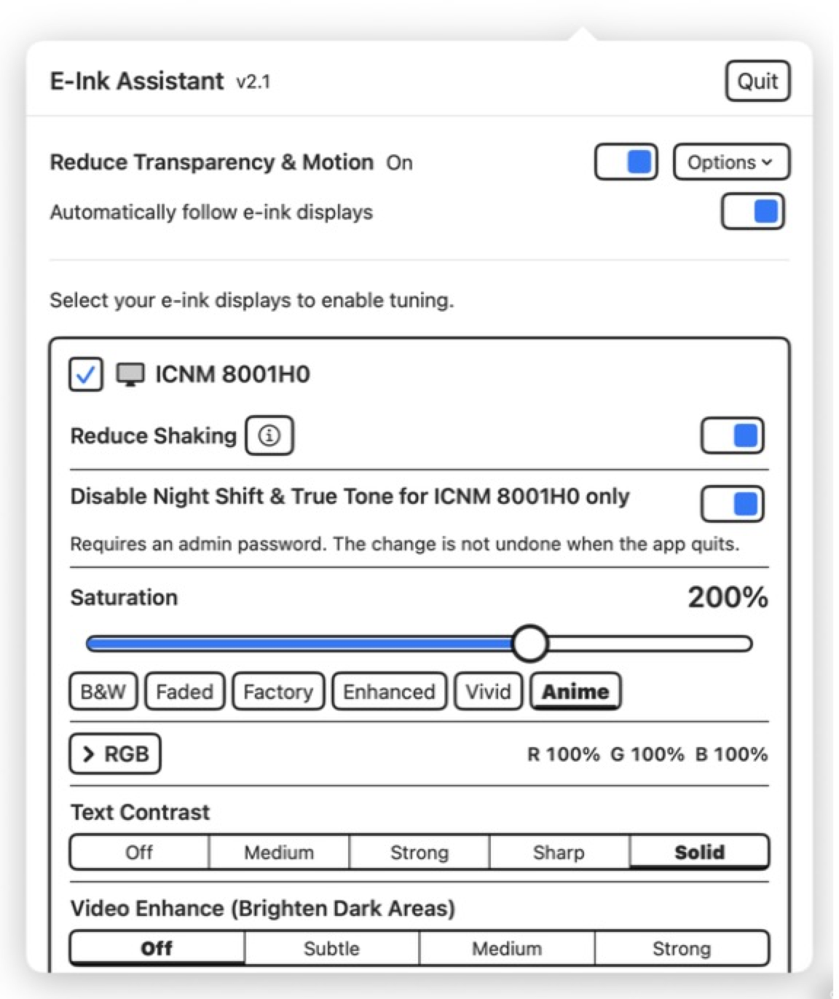
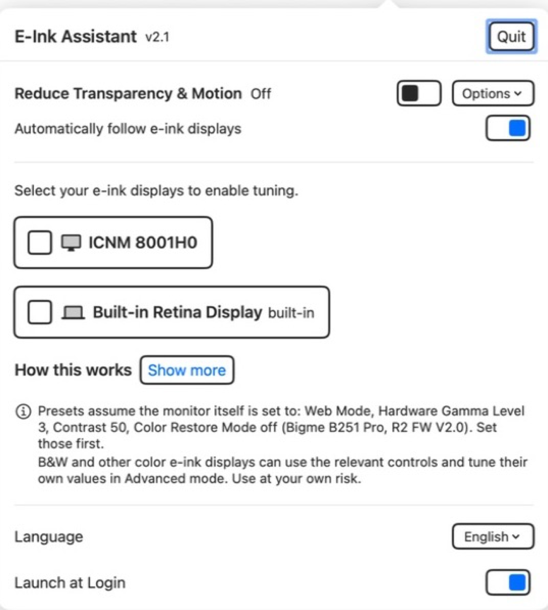

# E-Ink Assistant

<!-- BEGIN README LANGUAGES -->
<p align="center">
  <a href="../../README.md" lang="en" dir="ltr">English</a> &nbsp;·&nbsp;
  <b lang="zh-Hans" dir="ltr">简体中文</b> &nbsp;·&nbsp;
  <a href="README.zh-Hant.md" lang="zh-Hant" dir="ltr">繁體中文</a> &nbsp;·&nbsp;
  <a href="README.ja.md" lang="ja" dir="ltr">日本語</a> &nbsp;·&nbsp;
  <a href="README.ko.md" lang="ko" dir="ltr">한국어</a> &nbsp;·&nbsp;
  <a href="README.es.md" lang="es" dir="ltr">Español</a> &nbsp;·&nbsp;
  <a href="README.fr.md" lang="fr" dir="ltr">Français</a> &nbsp;·&nbsp;
  <a href="README.de.md" lang="de" dir="ltr">Deutsch</a> &nbsp;·&nbsp;
  <a href="README.pt-BR.md" lang="pt-BR" dir="ltr">Português (Brasil)</a> &nbsp;·&nbsp;
  <a href="README.ru.md" lang="ru" dir="ltr">Русский</a> &nbsp;·&nbsp;
  <a href="README.ar.md" lang="ar" dir="rtl">العربية</a> &nbsp;·&nbsp;
  <a href="README.hi.md" lang="hi" dir="ltr">हिन्दी</a>
</p>
<!-- END README LANGUAGES -->

<p align="center">
  
</p>

**为 macOS 和 Windows 上的黑白及彩色墨水屏调校显示效果。**

[访问产品网站](https://kiteretsu903.github.io/eink-assistant/zh-Hans/)

E-Ink Assistant（墨水屏助手）调节所选墨水屏的文字对比度、暗部细节与色彩。其他显示器保持不变。macOS 版运行于菜单栏，Windows 版运行于系统托盘。

[下载 macOS 2.6](https://github.com/kiteretsu903/eink-assistant/releases/download/macos-v2.6-windows-v1.2/E-Ink-Assistant-v2.6.dmg) ·
[下载 Windows 1.2](https://github.com/kiteretsu903/eink-assistant/releases/download/macos-v2.6-windows-v1.2/E-Ink-Assistant-Windows-1.2-Setup.exe) ·
[查看所有版本](https://github.com/kiteretsu903/eink-assistant/releases)

免费开源，采用 MIT 许可证。

## 功能与系统要求

| 功能 | macOS | Windows |
|---|---|---|
| 支持的系统 | **macOS 14 或更新版本**<br>仅支持 Apple 芯片 | **Windows 7 SP1 至 Windows 11**<br>x64 计算机 |
| 应用所在位置 | 菜单栏 | 系统托盘 |
| 选择指定的墨水屏 | 支持。其他显示器保持不变。 | 与 macOS 相同 |
| 文字对比度 | 四个级别：中等、强、锐利、实边 | 与 macOS 相同 |
| 视频暗部增强 | 三个级别：轻微、中等、强 | 与 macOS 相同 |
| 高级曲线与预设 | 实时曲线编辑器与五个命名预设 | 与 macOS 相同 |
| 饱和度与 RGB | 按显示器设置颜色配置文件；饱和度 0%–300%，RGB 0%–200% | 适用于符合条件的 Windows 10 2004 和 Windows 11 21H2+ 系统；可用方式取决于系统和硬件 |
| 减少抖动 | 适用于受支持的外接显示器；将显示器标记为墨水屏时自动开启 | 不支持。Windows 没有统一的公开接口来按显示器控制抖动，而且多数 Windows 系统可能并不需要此功能。 |
| 减少透明度与动态效果 | 通过用户确认一次的辅助指令提供 | 从 Windows 7 SP1 起可通过兼容的系统 API 使用 |
| 系统浅色模式 | 不更改 | Windows 10 1903+ 支持仅在应用运行期间使用 Windows 浅色模式 |
| Night Shift / 夜间模式 | 按显示器排除 Night Shift 与原彩显示；需要管理员批准并重新连接显示器 | Windows 10 1703+ 可打开夜间模式设置；Windows 11 24H2+ 可直接禁用夜间模式 |
| 镜像 / 复制显示器 | 镜像中的物理显示器仍可单独选择 | 色调曲线影响共享的显示源；饱和度与 RGB 需要扩展模式 |
| 恢复更改 | 退出时恢复临时曲线、颜色配置文件和抖动设置；Night Shift / 原彩显示排除设置会保留 | 退出时恢复临时伽马、色彩、视觉效果和夜间模式更改；异常退出后也可恢复色彩和夜间模式 |
| 登录时打开 | 支持 | 支持 |
| 界面语言 | 英语、简体中文、繁体中文、日语 | 与 macOS 相同 |
| 管理员权限 | 仅可选的 Night Shift / 原彩显示排除设置需要 | 安装程序和应用均需要 |

[macOS 详细说明](../../macos/README.md) ·
[Windows 兼容性与设置](../../WINDOWS.md) ·
[macOS 更新日志](../../CHANGELOG.md) ·
[Windows 更新日志](../../windows/CHANGELOG.md)

<p align="center">
  
</p>

## 控制选项

| 控制项 | 适用场景 | 作用 |
|---|---|---|
| 文字对比度 | 阅读 | 通过中等、强、锐利、实边四个级别加深浅色文字。更强的级别会牺牲灰阶细节，产生更硬的边缘。 |
| 视频暗部增强 | 照片和视频 | 通过轻微、中等、强三个级别呈现阴影细节。阅读时请关闭，因为它也会让深色文字变浅。 |
| 饱和度与 RGB | 彩色墨水屏 | 在平台支持时提供六个饱和度预设、0%–300% 饱和度滑块，以及 0%–200% RGB 校正。 |
| 减少抖动 | 受支持的 macOS 显示器 | 停止可见的抖动闪烁，并为已标记为墨水屏的显示器自动开启。 |
| Night Shift 与原彩显示 | 受色温变化影响的显示器 | 将所选 macOS 显示器排除在这两项功能之外。需要管理员批准并重新连接显示器，退出后设置仍会保留。 |
| 减少透明度与动态效果 | 刷新较慢的面板 | 简化系统视觉效果。macOS 通过用户确认一次的辅助指令实现。 |
| 高级曲线 | 针对具体面板微调 | 配合实时曲线图调节拐点、伽马、黑点和白点，并提供五个命名预设。 |

<p align="center">
  
  
  
</p>

> 这些图片仅用于说明控制项的效果。实际效果取决于面板和源内容。

## 安装

### macOS 14+，Apple 芯片

1. 使用上方链接下载 macOS 2.6 DMG。
2. 打开 DMG，将 **E-Ink Assistant** 拖入**应用程序**。
3. 先尝试打开应用一次。如果 macOS 阻止打开，请前往**系统设置 → 隐私与安全性**，选择**仍要打开**。

这是独立开发的软件，目前尚未上架 App Store。macOS 会在首次打开时显示“无法验证”警告。代码完全开源，你可以先审阅，再决定是否使用。

如果将应用移入“应用程序”后仍未出现**仍要打开**，请打开终端并运行：

```
xattr -dr com.apple.quarantine "/Applications/E-Ink Assistant.app"
```

### Windows 7 SP1 至 Windows 11，x64

1. 使用上方链接下载 Windows 1.2 安装程序。
2. 运行安装程序并批准管理员权限提示。
3. 从开始菜单或系统托盘打开 E-Ink Assistant。

请参阅 [WINDOWS.md](../../WINDOWS.md)，了解不同 Windows 版本、GPU、驱动程序和显示连接方式下各功能的具体可用性。

## 使用方法

<p align="center">
  
</p>

1. 从 macOS 菜单栏或 Windows 系统托盘打开应用。
2. 标记每台需要调校的黑白或彩色墨水屏。
3. 先在显示器自带菜单中设置均衡的硬件对比度。
4. 阅读时选择文字对比度，观看媒体时选择视频暗部增强，不要同时开启两者。
5. 使用彩色墨水屏时，可在平台支持的情况下调节饱和度与 RGB。

**退出应用时恢复显示调整**，启动时重新应用。开启**登录时打开**即可自动启动。

## 显示器设置

调节应用前，请先在显示器自带菜单中设置均衡的对比度。内置预设是在 **Bigme B251 Pro**（R2 FW V2.0）上，使用**网页模式、硬件伽马等级 3、对比度 50、关闭色彩还原模式**，通过目视调校得出。黑白面板或其他彩色型号需要各自适合的数值。高级模式提供完整的曲线调节功能，每台显示器的设置单独保存。

减少抖动仅支持 Apple Silicon，在不支持的设备上会自动隐藏。

<details>
<summary>macOS 减少透明度与动态效果辅助指令</summary>

首次使用时，需要在 Apple 的“快捷指令”应用中确认**添加快捷指令**。内置辅助指令只接受完全匹配的文本命令 `on` 和 `off`，不产生输出，也不会出现在共享表单、聚焦搜索、快速操作或锁定屏幕界面中。它可以在 Mac 锁定时运行。应用不会列出或查看你的其他快捷指令。

自动模式会在已标记的墨水屏连接时开启这两项设置，并在最后一台已标记的显示器断开后关闭。退出应用也会关闭这两项设置。

</details>

## 项目文档

- [CHANGELOG.md](../../CHANGELOG.md)：各版本的变更
- [TECHNICAL.md](../../TECHNICAL.md)：实现方式、测量结果，以及在现代 macOS 上*不起作用*的方法
- [mac-saturation](https://github.com/kiteretsu903/mac-saturation)：色彩机制研究和配置文件导出命令行工具

## 许可证与致谢

采用 MIT 许可证，详见 [LICENSE](../../LICENSE)。

**减少抖动基于 Abdullah Arif 开发的 [Stillcolor](https://github.com/aiaf/Stillcolor)**（MIT）。Stillcolor 发现可以通过 `enableDither` I/O Registry 属性禁用显示抖动。本项目将这一思路重新实现为按显示器控制；这一发现的功劳属于 Stillcolor。感谢！

完整声明见 [THIRD-PARTY-NOTICES.md](../../THIRD-PARTY-NOTICES.md)。
