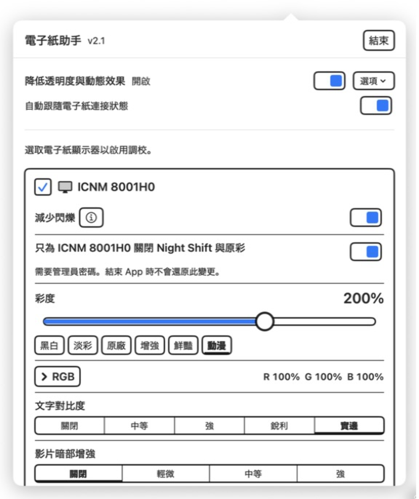
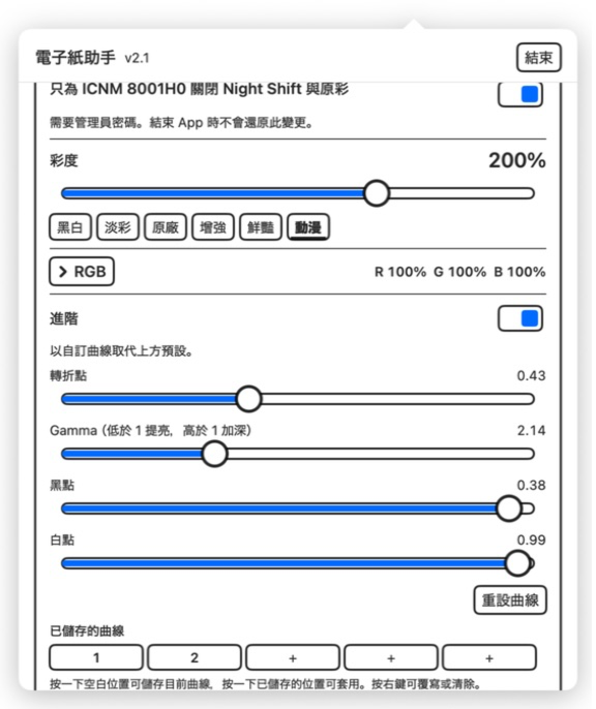
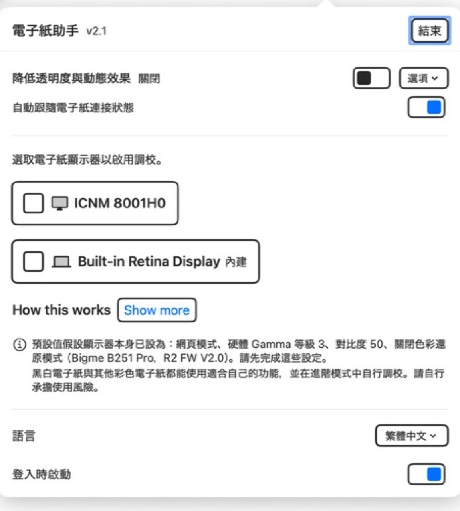

# 電子紙助手

<p align="center">
  <a href="../../README.md">English</a> &nbsp;·&nbsp;
  <a href="README.zh-Hans.md">简体中文</a> &nbsp;·&nbsp;
  <b>繁體中文</b> &nbsp;·&nbsp;
  <a href="README.ja.md">日本語</a>
</p>

<p align="center">
  
</p>

**在 macOS 上調校黑白與彩色電子紙顯示器。**

黑白與彩色電子紙都有更新慢、對比度有限、暗部細節容易消失，以及 macOS 抖動圖樣清楚可見等問題。
電子紙助手是一款輕巧的選單列 App，可逐台顯示器改善這些問題，不影響 Mac 內建螢幕。彩色電子紙
還能使用彩度與直接 RGB 調校。

採用 MIT 授權。

## 最新版本

**v2.6 — 2026 年 9 月 2 日**

- 新增可靠的鏡像模式支援，同時仍只調校已標記的實體電子紙。
- 在鏡像模式與延伸模式之間切換時，會及時重新整理並套用顯示設定。
- 結束清理現在也會處理在線的鏡像顯示器，同時不修改未標記的顯示器。
- 硬體設定提示現在明確說明需要在顯示器內建選單中調整對比度。

[下載最新版本](https://github.com/kiteretsu903/eink-assistant/releases/latest) · [查看完整更新記錄](../../CHANGELOG.md)

<p align="center">
  
</p>

## 主要功能

- **黑白與彩色電子紙皆適用**：減少抖動閃爍、加深文字、恢復影片與照片的暗部細節，並降低系統
  透明度與動態效果。
- **彩色電子紙專用**：以彩度補償較窄的色域，並直接調整紅、綠、藍來校正偏色。
- **閱讀與媒體模式分開**：文字對比度與影片暗部增強分別處理相反情境，兩者互斥。
- **逐顯示器控制**：只調校已標記的電子紙，其他顯示器保持不變。
- **自動還原**：結束時還原顯示調整，啟動時重新套用；輔助使用設定也會在結束時關閉。
- **進階調校**：直接調整完整色調曲線，並儲存五組可命名預設。

### 彩色電子紙能獲得哪些改善

- 包含下方黑白電子紙可獲得的所有改善。
- **彩度補償**：增強較窄的色域，提供六組預設與 0%–300% 滑桿。
- **直接 RGB 校正**：每個色彩通道可在 0%–200% 範圍內調整，用來消除偏紅、偏綠或偏藍；每台
  顯示器會分別儲存自己的 RGB 數值。
- **逐顯示器控制 Night Shift 與原彩**：避免 macOS 的色溫處理干擾刻意設定的色彩調校。

### 黑白電子紙能獲得哪些改善

- **減少閃爍**：在支援的顯示器上停止清楚可見的 macOS 抖動閃爍。
- **文字對比度**：加深淡色與次要文字，提升易讀性。
- **影片暗部增強**：恢復影片與照片中的暗部細節。
- **降低透明度與動態效果**：簡化系統視覺效果，並避免慢速更新螢幕難以呈現的動畫。
- **進階色調曲線調校**：針對面板本身的對比度反應進行調整。
- **選用的 Night Shift 與原彩控制**：當 macOS 色調偏移明顯影響灰階輸出時使用。

---

## 功能詳解

### 減少閃爍——黑白與彩色

macOS 會使用抖動（dithering）讓漸層更平滑。LCD 會在更新時把圖樣消除；電子紙會保留每個像素，
因此圖樣可能變成持續閃爍。關閉抖動後畫面會穩定下來。在支援的顯示器上，標記為電子紙後會自動開啟。

### 文字對比度——黑白與彩色

加深文字，讓它在低對比度面板上更容易與頁面分離。淡色與次要文字受益最大；在最強等級下，
其訊號對比度約可提升為四倍。


四個等級：**中等、強、銳利、實邊**。「中等」現在相當於先前的「強」，之後每級都更積極。
「實邊」會大幅壓縮黑點以取得最高區分度，顯示更清晰，但會損失更多灰階細節，字緣也會較硬。

### 影片暗部增強——黑白與彩色

只提亮最暗的色調，中間調與亮部保持不變，讓電子紙上容易消失的暗部細節重新可見。


三個等級：**輕微、中等、強**。它無法區分暗色畫面與深色文字，因此文字也會變淡。
**觀看影片與照片時開啟，閱讀時關閉。** 影片暗部增強與文字對比度互斥。

### 彩度——彩色電子紙

彩色電子紙在黑白面板上增加彩色濾光層，因此損失大量色域。彩度補償可以恢復更強的色彩訊號。
黑白電子紙維持 100% 即可。


預設 **黑白 / 淡彩 / 原廠 / 增強 / 鮮豔 / 動漫**，或使用 0%–300% 滑桿。

### RGB——彩色電子紙

直接在 **0%–200%** 範圍內調整**紅、綠、藍**，校正面板偏色。每台顯示器會分別儲存自己的
RGB 數值。控制項預設收合；按一下 **RGB** 即可顯示三個滑桿。收合時仍會顯示目前數值。
按一下**重設 RGB**可將三個色彩通道恢復為中性的 100%。

RGB 與彩度共用同一個逐顯示器色彩描述檔，因此兩者可一起使用，也不會干擾文字對比度或影片
暗部增強。

### 關閉 Night Shift 與原彩——主要用於彩色電子紙

兩者都會改變色彩與色調，可能與顯示調校互相干擾。電子紙助手可只將所選顯示器標記為電視，
讓 macOS 不對該面板套用這兩項功能。受到系統色調偏移影響的黑白電子紙也可能受益。

其他螢幕仍保留 Night Shift 與原彩。此操作需要管理員密碼，並需**中斷後重新連接該顯示器**，也是唯一不會在結束時
還原的設定。既有覆寫項目（包括自訂縮放解析度）會保留。

### 降低透明度與動態效果——黑白與彩色

這兩項系統輔助使用設定可提升易讀性，並避免慢速更新面板無法良好呈現的動畫。一次由使用者確認的
輔助捷徑，讓 App 取得安全的開啟／關閉控制，並可選擇自動跟隨顯示器連接狀態。

### 進階——黑白與彩色

直接控制轉折點、Gamma、黑點與白點，提供即時曲線圖和五個可儲存、可重新命名的槽位。

<p align="center">
  
</p>

> 比較圖片使用 App 的實際轉換產生，並在 LCD 上呈現。文字與影片範例另外模擬低對比度電子紙；
> 彩度範例直接呈現色彩變換。實際效果取決於面板。

---

## 安裝

需要 **macOS 14 或以上版本**以及 **Apple Silicon**。

```
git clone https://github.com/kiteretsu903/eink-assistant.git
cd eink-assistant
./build.sh
open "E-Ink Assistant.app"
```

建議從 [Releases](https://github.com/kiteretsu903/eink-assistant/releases) 下載 `.dmg`，開啟後將**電子紙助手**拖到安裝程式中顯示的
**應用程式**資料夾。

### 第一次啟動：通過 Gatekeeper

本 App 使用 **ad-hoc 簽署，未經 Apple 公證**，因此 macOS 第一次會拒絕開啟下載版本。
**在 macOS 15 或以上版本，按右鍵 →「打開」已不再有效。**

1. 先嘗試開啟一次 App，然後關閉警告。
2. 開啟**系統設定 → 隱私權與安全性**。
3. 找到 App 遭封鎖的訊息，按一下**強制打開**。
4. 確認。

將 App 拖入**「應用程式」**資料夾後，如果仍未顯示按鈕，可直接清除隔離旗標：

```
xattr -dr com.apple.quarantine "/Applications/E-Ink Assistant.app"
```

自行從原始碼建置不會帶有隔離旗標。

---

## 使用方式

<p align="center">
  
</p>

1. 從選單列開啟 App。
2. 標記要調校的黑白或彩色電子紙。
3. 在支援的顯示器上，減少閃爍會自動開啟。
4. 彩色電子紙可調整彩度與 RGB；黑白電子紙全部維持 100%。
5. 閱讀時選擇文字對比度，觀看媒體時選擇影片暗部增強，兩者不要同時使用。

系統全域的**降低透明度與動態效果**需要一次性**安裝並開啟**。在 Apple「捷徑」中確認
**加入捷徑**。隨附的輔助捷徑只接受文字，只辨識完全相符的 `on` 與 `off`，忽略其他輸入，
並以「無」動作結束，因此不會產生輸出。它不會出現在分享表單、Spotlight、快速動作或鎖定畫面介面中。
為了確保自動跟隨顯示器與結束時清理正常運作，它可在 Mac 鎖定時由 App 於背景執行；App 不會列出或
檢查你的其他捷徑。

自動模式會在已標記的電子紙連接時開啟兩項設定，並且只有最後一台已標記電子紙中斷連接後才關閉。
結束 App 時也會關閉兩項設定。

**結束時會還原顯示調整**，啟動時重新套用。開啟**登入時啟動**即可自動啟動。

---

## 顯示器範圍與預設

減少閃爍、文字對比度、影片暗部增強、系統輔助使用設定與進階曲線，都能讓**黑白與彩色電子紙**受益。
彩度補償與 RGB 校色則專門用於彩色面板。

請先完成顯示器硬體設定。內建預設是針對 **Bigme B251 Pro**（R2 FW V2.0），在**網頁模式、
硬體 Gamma 等級 3、對比度 50、關閉色彩還原模式**下目視調校。黑白面板或其他彩色型號需要
自己的數值；進階模式為此提供完整曲線。請依面板的實際顯示效果進行自訂調校。

減少閃爍只支援 Apple Silicon，在不支援的位置會自動隱藏。

---

## 更多資訊

- [CHANGELOG.md](../../CHANGELOG.md)：各版本更新內容
- [TECHNICAL.md](../../TECHNICAL.md)：實作原理、測量資料，以及新版 macOS 上**無法運作**的方法（英文）
- [mac-saturation](https://github.com/kiteretsu903/mac-saturation)：色彩機制調查與描述檔匯出工具（英文）

## 授權與致謝

MIT，請參閱 [LICENSE](../../LICENSE)。

**減少閃爍以 [Stillcolor](https://github.com/aiaf/Stillcolor)（作者 Abdullah Arif，MIT）為基礎。**
Stillcolor 發現可透過 `enableDither` I/O Registry 屬性關閉顯示器抖動。本專案按顯示器重新實作
這個概念；發現方法的功勞屬於 Stillcolor。謝謝。

完整聲明請見 [THIRD-PARTY-NOTICES.md](../../THIRD-PARTY-NOTICES.md)。
